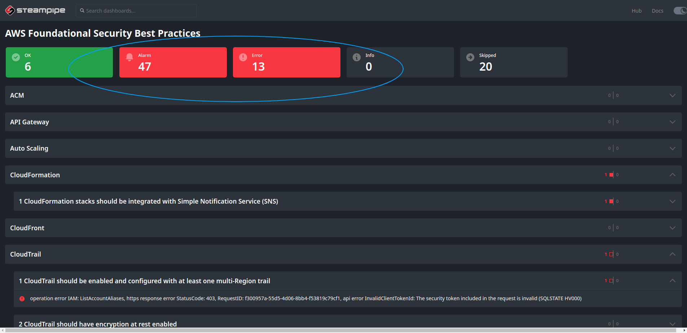

# AWS + Steampipe tests

AWS + Steampipe
AWS provides on-demand cloud computing platforms and APIs to authenticated customers on a metered pay-as-you-go basis.

Steampipe is an open source CLI to instantly query cloud APIs using SQL.

More at: https://hub.steampipe.io/plugins/turbot/aws

## Installation

Use the CLI to install

```bash
# Install
sudo /bin/sh -c "$(curl -fsSL https://raw.githubusercontent.com/turbot/steampipe/main/install.sh)"

# Install aws plugin
steampipe plugin install aws
```

## Usage

```bash
# Update (if already installed)
steampipe plugin install steampipe && steampipe plugin update aws

# Make a query
steampipe query "select name from steampipe_registry_plugin;"

# Testing aws compliance mod
git clone https://github.com/turbot/steampipe-mod-aws-compliance && cd steampipe-mod-aws-compliance && steampipe dashboard
```

## Results (Lab Account)

